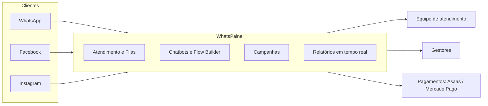

# 🚀 WhatsPainel

### **Plataforma SaaS completa para atendimento, automação e vendas via WhatsApp**

*Desenvolvido com ❤️ pela **MeuPost Team***

---

## 💡 Sobre o projeto

**WhatsPainel** é uma plataforma **SaaS** moderna que centraliza toda a comunicação da sua empresa com os clientes em um só lugar. Atendentes, chatbots, campanhas e relatórios trabalham juntos para transformar conversas em resultados — com organização, automação e escala, sem perder o toque humano.

Ideal para times de **atendimento, vendas e suporte** que precisam profissionalizar o relacionamento com o cliente.

---

## 🗺️ Visão geral

---

## 🎯 Para que serve

- **Centralizar o atendimento** de múltiplos canais em uma única caixa de entrada
- **Distribuir e organizar** conversas por filas, setores e atendentes
- **Automatizar** respostas, triagem e fluxos de conversa
- **Disparar campanhas** segmentadas e mensuráveis
- **Acompanhar métricas** de produtividade e satisfação em tempo real
- **Gerenciar várias empresas** em uma mesma instalação (multi-tenant)

---

## ✨ Funcionalidades

### 💬 Gestão de atendimento
- Tickets organizados por filas e setores
- Distribuição automática e transferência entre atendentes
- Notas internas, tags e histórico completo de conversas
- Mensagens rápidas e templates

### 🤖 Automação inteligente
- Flow Builder visual (arrastar e soltar)
- Chatbots personalizáveis
- Respostas com IA e horário de funcionamento automático
- Integração com TypeBot e workflows com n8n

### 📣 Campanhas e marketing
- Disparos em massa personalizados e agendados
- Listas de contatos segmentadas
- Variáveis dinâmicas nas mensagens
- Análise de entrega e performance

### 💼 Gestão empresarial
- Sistema multi-empresa (SaaS)
- Planos e assinaturas flexíveis
- Relatórios gerenciais detalhados
- Controle de usuários e permissões

---

## 🔌 Conexões e integrações

| Categoria | Integrações |
| --- | --- |
| **Canais** | WhatsApp, Facebook Messenger, Instagram Direct |
| **Automação** | TypeBot, n8n, fluxos e chatbots nativos |
| **Pagamentos** | Asaas, Mercado Pago |

---

## 🛠️ Tecnologia

- **Aplicação:** Node.js + Express (TypeScript)
- **Interface:** React + Material-UI (tema claro/escuro)
- **Dados:** PostgreSQL + Redis (cache e filas)
- **Tempo real:** Socket.io para eventos e notificações
- **Infraestrutura:** Docker e Nginx

---

## 🏢 Casos de uso

- **E-commerce:** recuperação de carrinho, status de pedidos e suporte pós-venda
- **Serviços:** agendamentos, lembretes e confirmação de horários
- **Educação:** suporte a alunos, envio de materiais e avisos
- **Equipes de vendas:** prospecção, follow-up e qualificação de leads

---

## 🆕 Atualizações e novidades

Acompanhe o que muda a cada versão do WhatsPainel:

- 📋 **Histórico de versões:** [CHANGELOG.md](CHANGELOG.md)
- 🏷️ **Notas de cada versão:** [Releases](../../releases)

---

## 🐞 Reportar problemas

Encontrou um problema, comportamento inesperado ou quer sugerir uma melhoria? Abra uma solicitação — sua contribuição ajuda a melhorar o WhatsPainel.

➡️ **Abrir uma solicitação:** [Issues](../../issues/new/choose)

Para agilizar o atendimento, inclua sempre que possível:

- ✅ **Versão** do WhatsPainel (ex.: `6.2.1`)
- ✅ **O que aconteceu** e **o que era esperado**
- ✅ **Passos para reproduzir**
- ✅ **Prints** que ajudem a entender o caso

> 🔒 Nunca inclua senhas, tokens ou dados sensíveis nas solicitações públicas.

---

## 📞 Vendas e suporte

Fale com a nossa equipe — atendimento humano para tirar dúvidas, contratar ou resolver problemas.

[%208102--8003-25D366?style=for-the-badge&logo=whatsapp&logoColor=white)](https://wa.me/556981028003)

- 💬 **WhatsApp (Vendas e Suporte):** [(69) 8102-8003](https://wa.me/556981028003)
- 📧 **E-mail:** contato@lojadescripts.net
- 🌐 **Site:** [lojadescripts.net](https://lojadescripts.net)

---

## 📄 Licença

Distribuído sob a licença **MIT**. Veja o arquivo [LICENSE](LICENSE) para detalhes.

---

### MeuPost Team

*Transformando a comunicação empresarial através da tecnologia*

**[⬆ Voltar ao topo](#-whatspainel)**

